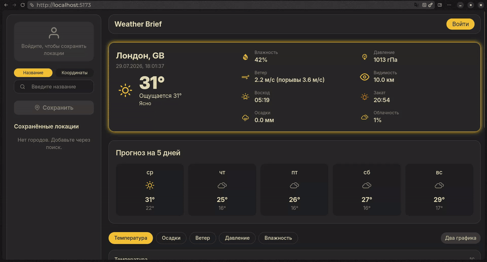
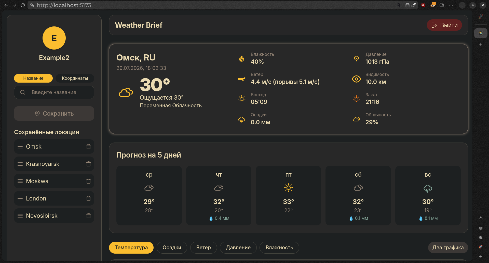
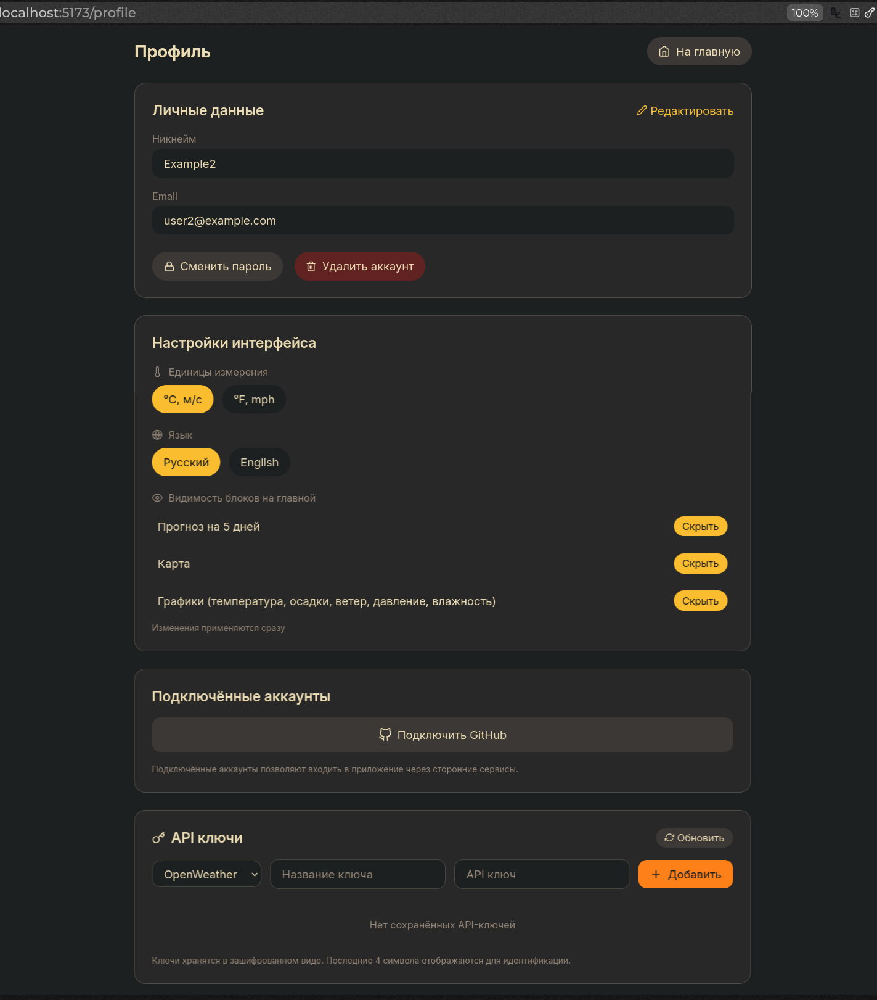
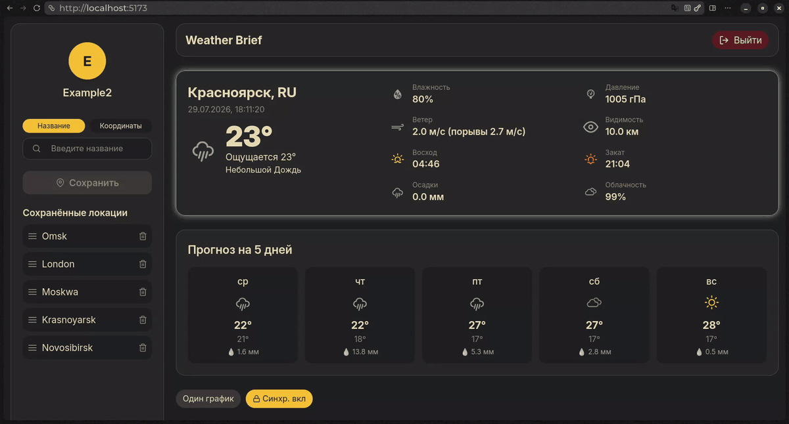
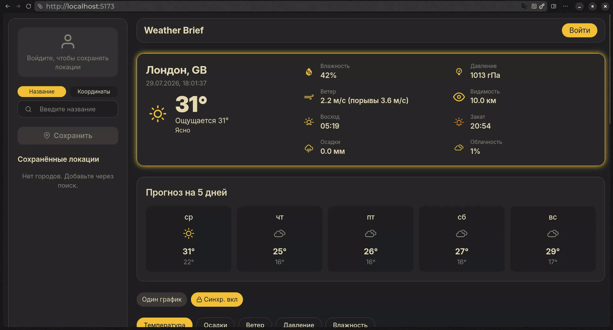

<!-- Header and Badges -->

<div align="center">
  
  
  
  
  
  
  
</div>

<br/>

# 🌤️ Weather Brief

**Weather Brief** – это современное веб-приложение для просмотра погоды, разработанное на **React** (фронтенд) и **FastAPI** (бэкенд). Проект позволяет пользователям:

- 📍 Искать города по названию или координатам  
- 📊 Смотреть текущую погоду и 5-дневный подробный прогноз  
- ⭐ Сохранять избранные города с возможностью drag‑drop переупорядочивания  
- 🔐 Входить через email/пароль или через GitHub OAuth  
- 💥 Использовать свой API ключь OpenWeather, указав его в настройках пользователя
- 🗺️ Отслеживать город на интерактивной карте  
- 📈 Строить графики температуры, осадков, ветра, давления и влажности  

Проект полностью контейнеризирован с помощью **Docker** и готов к развертыванию.

<div align="center">
  
  <br/>
  <em>Интерфейс приложения: главная страница с погодой сейчас, на 5 дней, графиками погоды</em>
</div>

---

> 💡 **Интерактивная документация API** доступна после запуска бэкенда по адресу:  
> [http://127.0.0.1:8000/docs](http://127.0.0.1:8000/docs)

---

## Оглавление

- [🛠 Технологический стек](#-технологический-стек)
- [✨ Основные возможности](#-основные-возможности)
  - [🔐 Аутентификация и управление пользователями](#-аутентификация-и-управление-пользователями)
  - [🌦️ Погода и прогноз](#️-погода-и-прогноз)
  - [📊 Визуализация данных](#-визуализация-данных)
  - [⭐ Управление избранными городами](#-управление-избранными-городами)
  - [🔑 Управление API‑ключами](#-управление-apiключами)
  - [🔗 Интеграции](#-интеграции)
  - [🧩 Дополнительные возможности](#-дополнительные-возможности)
- [📸 Скриншоты и демонстрация](#-скриншоты-и-демонстрация)
- [🚀 Быстрый старт (с Docker)](#-быстрый-старт-с-docker)
- [💻 Локальный запуск (для разработчиков)](#-локальный-запуск-для-разработчиков)
- [⚙️ Переменные окружения](#️-переменные-окружения)
- [📂 Структура проекта](#-структура-проекта)
- [📄 Лицензия](#-лицензия)

---

## 🛠 Технологический стек

### Backend

- **FastAPI** — высокопроизводительный веб-фреймворк для создания REST API (с автоматической генерацией OpenAPI и документации Swagger).
- **SQLAlchemy** — ORM для работы с базами данных.
- **Alembic** — инструмент для управления миграциями схемы базы данных.
- **Pydantic** — валидация данных и сериализация/десериализация объектов.
- **Redis** — кэширование ответов от OpenWeatherMap для снижения нагрузки и ускорения работы.
- **OAuth2 (GitHub)** — встроенная поддержка входа через внешние провайдеры с использованием библиотеки `authlib`.
- **SlowAPI** — защита от перебора и DDoS-атак (rate limiting).

### Frontend

- **React** — библиотека для построения пользовательских интерфейсов (функциональные компоненты + хуки).
- **Vite** — сверхбыстрый сборщик и инструмент разработки (HMR, оптимизация сборки).
- **Tailwind CSS** — утилитарный CSS-фреймворк для быстрой стилизации без написания кастомных классов.
- **React Router v6** — маршрутизация и навигация в SPA.
- **Recharts** — библиотека для построения адаптивных графиков (температура, осадки, ветер, давление, влажность).
- **Leaflet (react-leaflet)** — интерактивная карта с отображением местоположения города.
- **react-icons** — набор векторных иконок для интерфейса.
- **@dnd-kit** — библиотека для реализации drag‑and‑drop (перетаскивание сохранённых городов).
- **axios / fetch** — HTTP-клиенты для связи с бэкендом (используется нативный `fetch`).

### Инфраструктура и DevOps

- **Docker** — контейнеризация приложения для упрощения развёртывания.
- **Docker Compose** — оркестрация нескольких контейнеров (бэкенд, фронтенд, Redis, база данных).

### Хранилища и базы данных

- **SQLite** — встроенная реляционная БД для разработки и лёгкого тестирования.
- **Redis** — in‑memory хранилище для кэша.

### Документация

- **Swagger UI** / **ReDoc** — интерактивная документация API (автоматически генерируется FastAPI).

--- 

## ✨ Основные возможности

### 🔐 Аутентификация и управление пользователями

- **Регистрация и вход** по email и паролю с подтверждением и валидацией.
- **Вход через GitHub OAuth** — быстрая авторизация без создания отдельного пароля.
- **Управление профилем**: смена никнейма, email, создание/изменение пароля (для пользователей без пароля — возможность его установить).
- **Подключение внешних аккаунтов** (GitHub) с возможностью отвязать их, если есть альтернативный способ входа.
- **Защита от потери доступа**: отвязка единственного провайдера блокируется с понятным предупреждением.

### 🌦️ Погода и прогноз

- **Текущая погода**: температура, ощущается как, влажность, давление, ветер, видимость, облачность, осадки, восход и закат.
- **Прогноз на 5 дней**: ежедневные минимумы/максимумы, иконки погоды, сумма осадков (дождь/снег).
- **Почасовые данные** с шагом 3 часа для построения детальных графиков.
- **Поиск городов** по названию (с автодополнением) или по координатам (широта/долгота).
- **Интерактивная карта** (Leaflet) с маркером текущего города и попапом с температурой.

### 📊 Визуализация данных

- **Графики** для температуры, осадков, ветра, давления и влажности на основе почасовых данных.
- **Режимы отображения**: один или два графика одновременно.
- **Синхронизация прокрутки** двух графиков для удобного сравнения.
- **Переключение между метрической и имперской системами** (℃/℉, м/с/mph) — данные пересчитываются автоматически.

### ⭐ Управление избранными городами

- **Добавление/удаление** городов в список сохранённых.

- **Drag‑drop переупорядочивание** списка избранных городов (удобно расставлять приоритеты).

- **Быстрое переключение** между сохранёнными городами.

- **Подтверждение удаления** города через стилизованное модальное окно.

### 🔑 Управление API‑ключами

- **Добавление/удаление** API‑ключей для погодных сервисов (сейчас поддерживается OpenWeather).
- **Валидация ключа** перед сохранением (проверяется через реальный запрос к OpenWeather).
- **Шифрованное хранение** ключей на бэкенде (расшифровка доступна только по запросу, с подтверждением).
- **Отображение последних 4 символов** для идентификации ключа без раскрытия полного значения.
- **Активация/деактивация** ключей без их удаления.

### 🔗 Интеграции

- **GitHub OAuth** — быстрая регистрация и вход.
- **OpenWeatherMap** — получение данных о погоде (текущая, прогноз, геокодинг).
- **Redis** — кэширование запросов к OpenWeather для ускорения работы и снижения нагрузки.

### 🧩 Дополнительные возможности

- **Адаптивный дизайн**: корректно работает на десктопах, планшетах и мобильных устройствах.
- **Горизонтальная прокрутка графиков** при большом количестве точек.
- **Сохранение настроек** в профиле пользователя (язык, единицы измерения) и в localStorage для гостей.
- **Автоматическое обновление токенов** (refresh‑токен в httpOnly cookie, access‑токен в памяти).
- **Защита от CSRF** и безопасное хранение refresh‑токена.

---

## 📸 Демонстрация

<div align="center">
  
  <br/>
  <em>Главный экран с текущей погодой и прогнозом</em>
</div>

<div align="center">

  <br/>
  <em>Страницы входа в аккаунт и регистрации</em>
</div>

<div align="center">

  <br/>
  <em>Страница профиля с настройками и управлением API-ключами</em>
</div>

---

<div align="center">
  
  <br/>
  <em>Возможности профиля пользователя</em>
</div>

<div align="center">
  
  <br/>
  <em>Вид приложения у зарегистрированного пользователя</em>
</div>

---

## 💻 Локальный запуск

В этом разделе описаны шаги для запуска проекта в режиме разработки на локальной машине. Предполагается, что у вас установлены **Python 3.11+**, **Node.js 18+** и **npm**.

### 📦 Клонирование репозитория

```bash
git clone https://github.com/Nu-nik-kak-nik/WeatherBrief.git
cd WeatherBrief
```

### 🐍 Бэкенд (FastAPI)

1. **Создайте и активируйте виртуальное окружение**

```bash
python -m venv venv
source venv/bin/activate      # Linux/macOS
# venv\Scripts\activate       # Windows
```

2. **Установите зависимости**

```bash
pip install -r requirements.txt
```

3. **Настройте переменные окружения**

Создайте в корне проекта файл `.env` (рядом с `README.md`) и заполните его:

```env
# === Обязательные переменные ===
SECRET_KEY=your-secret-key-min-32-characters
SESSION_SECRET_KEY=your-session-secret-min-32-characters
FERNET_ENCRYPTION_KEY=your-fernet-key-base64-urlsafe

# === OpenWeather API ===
OPENWEATHER_API_KEY=your-openweather-api-key  # получить на openweathermap.org

# === OAuth (опционально) ===
GITHUB_CLIENT_ID=client-id # если не нужен оставте так
GITHUB_CLIENT_SECRET=need-client-secret # если не нужен оставте так
GOOGLE_CLIENT_ID=need-client-id # если не нужен оставте так
GOOGLE_CLIENT_SECRET=need-client-secret # если не нужен оставте так

# === Frontend ===
VITE_API_BASE_URL=/api
VITE_FRONTEND_OAUTH_CALLBACK_URL=http://localhost:5173/oauth/callback

# === Прочее ===
LOG_LEVEL=INFO
FRONTEND_OAUTH_CALLBACK_URL=http://localhost:5173/auth/oauth/callback
```

> 🔑 **Генерация ключей**:  
> 
> - `SECRET_KEY` и `SESSION_SECRET_KEY` – можно сгенерировать с помощью `openssl rand -hex 32`.  
> - `FERNET_ENCRYPTION_KEY` – создайте с помощью `python -c "from cryptography.fernet import Fernet; print(Fernet.generate_key().decode())"`.
> 
> **Примечание**:
> 
> - `VITE_API_BASE_URL=/api` – используйте прокси Vite для перенаправления запросов на бэкенд.
> - Если вы запускаете бэкенд на другом порту или хосте, укажите полный URL (например, `http://localhost:8000`).

4. **Запустите бэкенд**

```bash
uvicorn app.main:app --host localhost --port 8000 --reload
```

Или:

```bash
python -m app.main
```

После успешного запуска Swagger-документация будет доступна по адресу:  
[http://localhost:8000/docs](http://localhost:8000/docs)

---

### ⚛️ Фронтенд (React + Vite)

1. **Перейдите в папку фронтенда**

```bash
cd frontend
```

2. **Установите зависимости**

```bash
npm install
```

3. **Запустите dev-сервер**

```bash
npm run dev
```

Фронтенд будет доступен по адресу: [http://localhost:5173](http://localhost:5173)

---

### ✅ Проверка работоспособности

1. Откройте [http://localhost:5173](http://localhost:5173) – должна загрузиться главная страница.
2. Попробуйте зарегистрироваться или войти (используйте email/пароль или GitHub).
3. Проверьте, что отображается погода для города по умолчанию (London).
4. Перейдите в Swagger по [http://localhost:8000/docs](http://localhost:8000/docs) – убедитесь, что бэкенд отвечает.

---

## ⚙️ Переменные окружения

Для работы приложения необходимо настроить переменные окружения. Ниже приведена полная таблица с описанием всех переменных, их обязательностью и примерами значений.

> **Важно:**  
> 
> - Переменные для **фронтенда** должны начинаться с префикса `VITE_`, иначе они не будут доступны в коде через `import.meta.env`.  
> - Файл `.env` должен находиться в корне проекта.

---

### 🖥️ Бэкенд (FastAPI)

#### Обязательные переменные

| Переменная              | Описание                                                                                                       |
| ----------------------- | -------------------------------------------------------------------------------------------------------------- |
| `SECRET_KEY`            | Секретный ключ для подписи JWT-токенов. Минимум 32 символа.                                                    |
| `SESSION_SECRET_KEY`    | Секретный ключ для шифрования сессий (используется в SessionMiddleware).                                       |
| `FERNET_ENCRYPTION_KEY` | Ключ для симметричного шифрования (Fernet). Должен быть в формате base64‑urlsafe (44 символа).                 |
| `OPENWEATHER_API_KEY`   | API-ключ для доступа к OpenWeatherMap. Получить можно на [openweathermap.org](https://openweathermap.org/api). |

#### Опциональные переменные

| Переменная             | Описание                                                                          |
| ---------------------- | --------------------------------------------------------------------------------- |
| `GITHUB_CLIENT_ID`     | Client ID приложения GitHub OAuth. Если не нужен, оставьте `client-id`.           |
| `GITHUB_CLIENT_SECRET` | Client Secret приложения GitHub OAuth.                                            |
| `GOOGLE_CLIENT_ID`     | Client ID приложения Google OAuth.                                                |
| `GOOGLE_CLIENT_SECRET` | Client Secret приложения Google OAuth.                                            |
| `LOG_LEVEL`            | Уровень логирования (DEBUG, INFO, WARNING, ERROR, CRITICAL). По умолчанию `INFO`. |

---

### 🖥️ Фронтенд (React + Vite)

Все фронтенд-переменные должны начинаться с `VITE_`.

#### Обязательные переменные

| Переменная                         | Описание                                                                                                                                                                                                  |
| ---------------------------------- | --------------------------------------------------------------------------------------------------------------------------------------------------------------------------------------------------------- |
| `VITE_API_BASE_URL`                | Базовый URL для API-запросов. В режиме разработки обычно указывается `/api` (прокси Vite). В продакшене — абсолютный адрес бэкенда.                                                                       |
| `VITE_FRONTEND_OAUTH_CALLBACK_URL` | Адрес страницы фронтенда, на которую будет перенаправлен пользователь после успешного OAuth‑входа (обрабатывается компонентом `OAuthCallbackPage`). По умолчанию: `http://localhost:5173/oauth/callback`. |

---

### 🔧 Генерация ключей

Для генерации надёжных ключей используйте следующие команды:

- **SECRET_KEY / SESSION_SECRET_KEY**:
  
  ```bash
  openssl rand -hex 32
  ```

- **FERNET_ENCRYPTION_KEY**:
  
  ```bash
  python -c "from cryptography.fernet import Fernet; print(Fernet.generate_key().decode())"
  ```

Убедитесь, что эти ключи хранятся в безопасности и не попадают в репозиторий.
---

## 📂 Структура проекта

Проект организован как монорепозиторий, содержащий бэкенд на FastAPI и фронтенд на React. Ниже приведена упрощённая схема основных директорий и файлов.

```
.
├── app/                              # Бэкенд (FastAPI)
│   ├── core/                         # Ядро приложения
│   │   ├── auth.py                   # JWT-аутентификация
│   │   ├── cache.py                  # Работа с Redis
│   │   ├── core_settings.py          # Основные настройки
│   │   ├── exceptions.py             # Кастомные исключения
│   │   ├── logger.py                 # Настройка логирования
│   │   ├── oauth.py                  # OAuth2 (GitHub)
│   │   └── weather_settings.py       # Настройки погодного API
│   ├── db/                           # База данных
│   │   ├── repositories/             # Репозитории для работы с БД
│   │   ├── base_weather.py           # Базовый класс для моделей
│   │   └── session_weather.py        # Управление сессиями SQLAlchemy
│   ├── migrations/                   # Миграции Alembic
│   │   └── versions/                 # Файлы миграций
│   ├── models/                       # Модели SQLAlchemy
│   │   └── weather.py
│   ├── routes/                       # Эндпоинты API
│   │   ├── api_keys.py               # Управление API-ключами
│   │   ├── auth_providers.py         # Управление провайдерами аутентификации
│   │   ├── auth.py                   # Аутентификация и OAuth
│   │   ├── location.py               # Сохранённые локации
│   │   ├── users.py                  # Профиль пользователя
│   │   └── weather_api.py            # Погодные эндпоинты
│   ├── schemas/                      # Pydantic-схемы
│   │   └── weather/
│   ├── services/                     # Бизнес-логика
│   │   ├── db_services/              # Сервисы для работы с БД
│   │   ├── utils/                    # Утилиты (криптография, валидация)
│   │   └── weather/                  # Клиенты и парсеры OpenWeather
│   └── main.py                       # Точка входа бэкенда
│
├── frontend/                         # Фронтенд (React + Vite)
│   ├── public/
│   │   ├── favicon.svg
│   │   └── index.html
│   ├── src/
│   │   ├── components/               # React-компоненты
│   │   │   ├── common/               # Общие компоненты (GlassCard, Spinner, etc.)
│   │   │   ├── layout/               # Layout-компоненты (Sidebar, Header, Layout)
│   │   │   ├── user/                 # Компоненты для профиля и авторизации
│   │   │   └── weather/              # Погодные компоненты (карточки, графики, карта)
│   │   ├── constants/                # Константы (переводы, градиенты)
│   │   ├── contexts/                 # React Context (Auth, User, Settings, Weather, Theme)
│   │   ├── hooks/                    # Кастомные хуки
│   │   ├── pages/                    # Страницы (Login, Register, Profile, OAuthCallback)
│   │   ├── services/                 # API-клиенты
│   │   │   └── api/
│   │   ├── styles/                   # Глобальные стили и анимации
│   │   ├── utils/                    # Утилиты (конвертация единиц, акценты погоды)
│   │   ├── App.jsx                   # Корневой компонент с роутингом
│   │   ├── index.css
│   │   └── main.jsx                  # Точка входа фронтенда
│   ├── .gitignore
│   ├── index.html
│   ├── package.json                  # Зависимости и скрипты
│   ├── postcss.config.js             # Конфигурация PostCSS для Tailwind
│   ├── tailwind.config.js            # Настройки Tailwind CSS
│   └── vite.config.js                # Конфигурация Vite (прокси, плагины)
│
├── logs/                             # Логи бэкенда
├── .env                              # Переменные окружения (общие)
├── .gitignore
├── alembic.ini                       # Конфигурация Alembic
├── README.md                         # Этот файл
├── requirements.txt                  # Зависимости Python
└── weather.db                        # База данных SQLite (создаётся автоматически)
```

---

## 📄 Лицензия

Проект распространяется под лицензией **MIT**. Это означает, что вы можете свободно использовать, модифицировать и распространять код.
